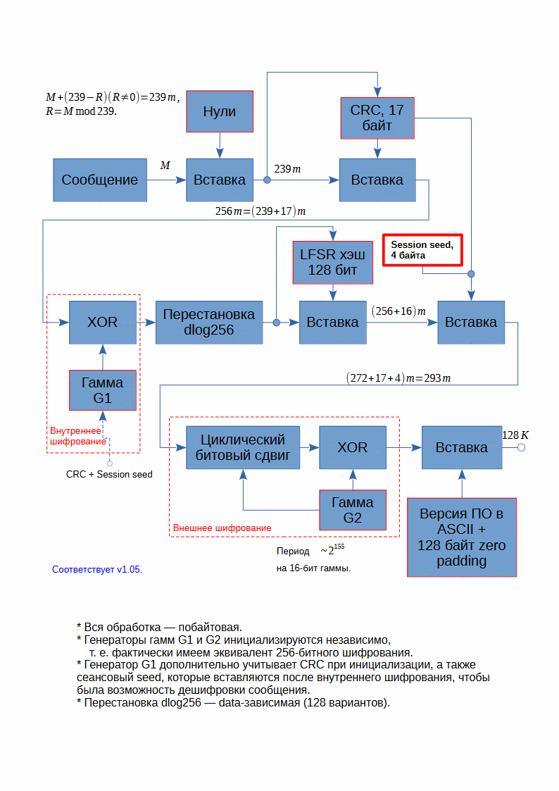

# AllPass - Менеджер паролей

## Вводная часть

Менеджер паролей **AllPass** поддерживает

* Двойное 128-битное шифрование, основанное на LFSR-регистрах, модулированных пилообразным кодом (итог авторского исследования, см. репозиторий lfsr).

* Автоматическое поддержание резервной копии хранилища и восстановление в случае порчи/удаления основного хранилища.

* Множество хранилищ, которые определяются 4-х значным пин-кодом и мастер-фразой, которая может быть произвольным текстом на любом языке (юникод).

* Генерацию паролей, основанную на на LFSR-регистрах, модулированных пилообразным кодом.

После запуска программы требуется ввести пин-код и далее мастер-фразу, которую необходимо хранить отдельно. При утере мастер-фразы и/или пин-кода восстановить данные будет невозможно.

После ввода пин-кода и мастер-фразы отобразится имя активного хранилища. Данное имя соответствует имени файла в корне приложения. Эти файлы можно сохранять как бэкап где-угодно и при необходимости подменять их простым копированием.

При неудачном удалении строк таблицы, удалении паролей в ячейках можно нажать кнопку восстановления из активного хранилища. После потребуется подтвердить согласие и ввести свой пин-код. Таблица будет полностью перезаписана таблицей из активного хранилища.

После закрытия приложения обновленная (текущая) таблица будет сохранена на диск.

При удалении/порче файла-хранилища программа (после ввода пин-кода и мастер-фразы) автоматически восстановит данные из резервной копии.

Генерируемые пароли могут быть длиной от 15 до 80 печатаемых ASCII-символов, кроме Space и Delete.

Иконки для кнопок взяты с https://icons8.ru

## Изменения относительно версии 1.05

### Версия 1.06, 08.01.2025

* Добавлена возможность смены ключа - пин-кода и мастер-фразы - с автоматическим переносом текущих данных.

* Убраны лишние кнопки.

* Добавлен вывод количества записей в таблице.

* Добавлена кнопка очистки таблицы.

* Добавлено сохранение даты изменения пароля (просмотр доступен по контекстному меню ячейки с паролем).

## Основные идеи шифрования хранилища

В целом, основное ядро шифрования - потоковый шифр (гаммирование), основанный на LFSR-регистрах, модулированных пилообразным кодом. Однако, простому гаммированию присущ такой недостаток как вскрытие гаммы при известном сообщении: это, например, стандартные заголовки сетевых пакетов, вставка нулей (zero padding), подмена сообщения и т.п.

Для преодоления недостатков гаммирования было введено двойное шифрование: первое - простое гаммирование гаммой G1, а второе - гаммирование с битовым циклическим сдвигом символов, зависящим от гаммы G2 (нелинейное преобразование).

Для преодоления недостатков гамм, основанных на простых LFSR, была введена модуляция пилообразным кодом, а также специальное комплексирование нескольких LFSR-генераторов в пары, направленное на

* рост общего периода (достижение единичного НОД).

* повышение случайности периода.

* нарушение линейности гаммы за счет использования суммы по некоторому простому модулю совместно с итоговым побитовым XOR.

Между двумя этапами шифрования G1 и G2 делается дата-зависимая перестановка данных по правилу дискретного логарифма с простым числом 257. Дополнительно, первая гамма G1 зависит от контрольной суммы по исходным данным, которая используется для внутренней детекции ошибок, а также от сеансового seed, который меняет шифротекст при неизменной таблице. Данная контрольная сумма и seed защищаются второй гаммой G2 (внешней гаммой). Вторая гамма также защищает общий 128-битный хеш (смотри репозиторий lfsr128sum), который также используется для детекции ошибок (внешняя детекция).

Диаграмма шифрования сообщения показана на рисунке ниже.

